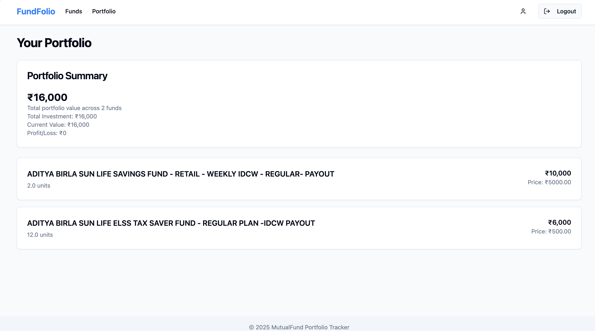
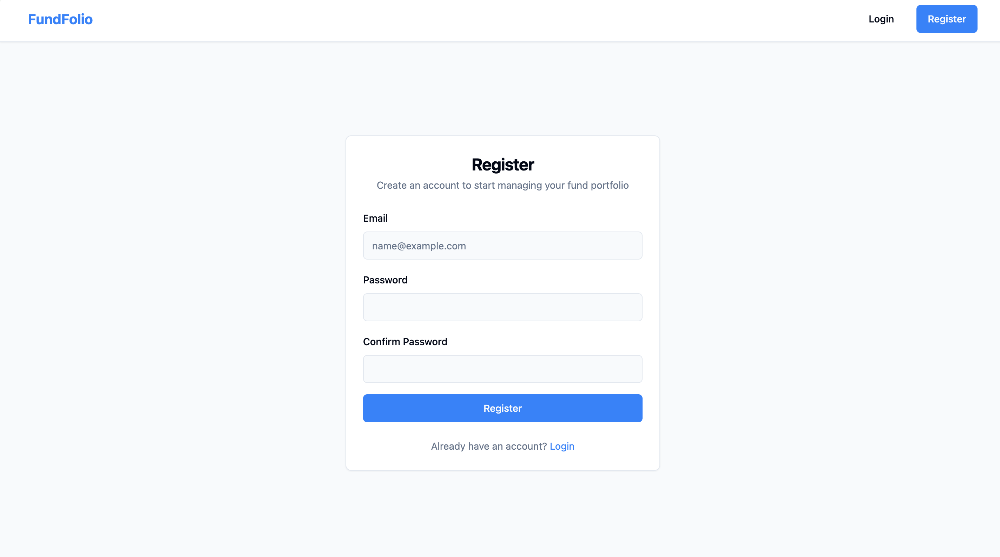
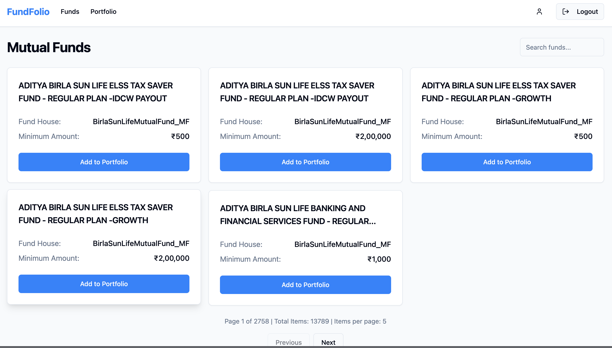

# Mutual Fund Broker

## Environment Variables

This project requires a `.env` file in the root directory with the following environment variables:

```env
DATABASE_URL=<your_database_url>
SECRET_KEY=<your_secret_key>
ALGORITHM=<encryption_algorithm>
ACCESS_TOKEN_EXPIRE_MINUTES=<token_expiry_in_minutes>
RAPIDAPI_KEY=<your_rapidapi_key>
RAPIDAPI_HOST=<rapidapi_host>
REACT_APP_API_URL=<backend_api_url>
```

A project for managing mutual fund transactions and brokerage operations.

## Prerequisites

Before running this project, make sure you have the following installed:
- Docker
- Docker Compose

## Running with Docker

1. Build and start the containers:
```bash
docker-compose up --build
    - This will spin up backend, frontend containers and take care of database migrations inside backend container.
    - Note: we havent created seperate ontiner for database. all are running inside backend container. and on the destruction of backend container, database will be destroyed.
    - docker-compose up --build -d:
        - backend and frontend containers will be up in detached mode.







